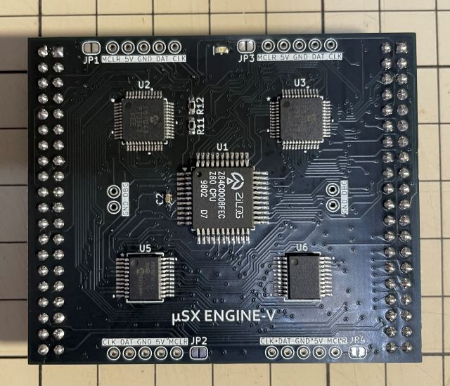
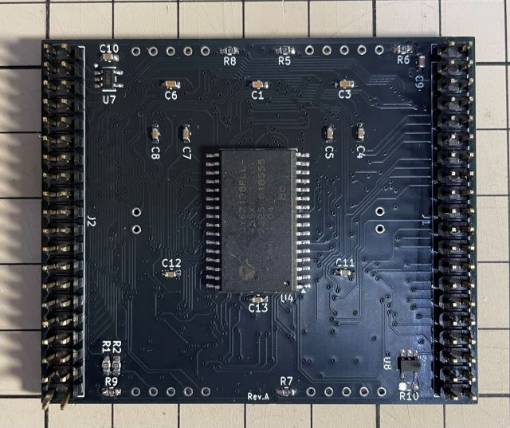
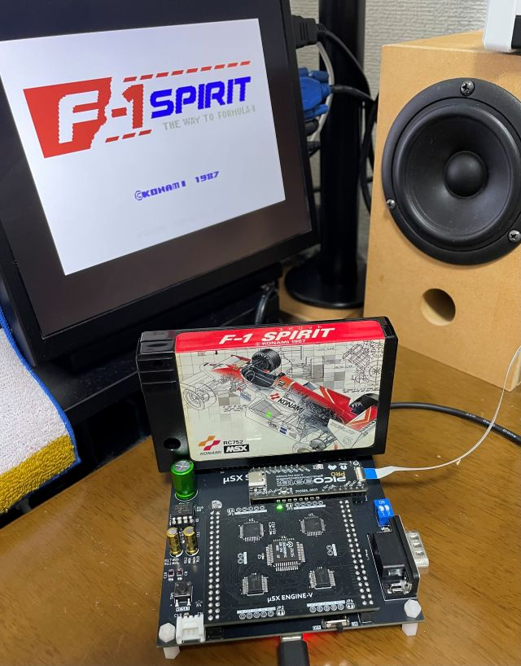
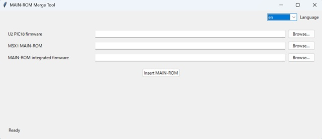
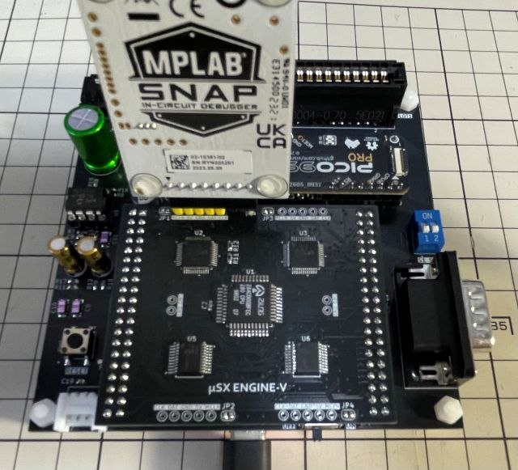
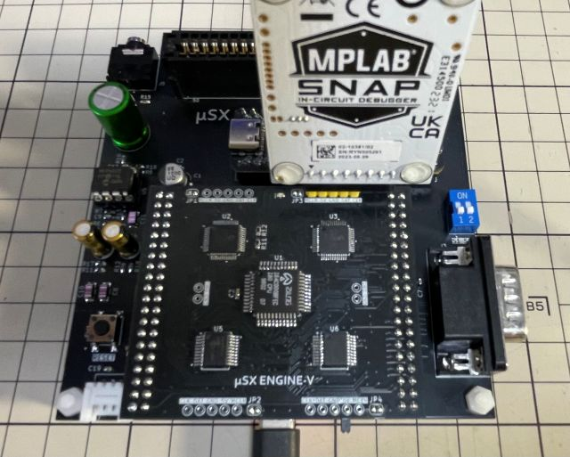
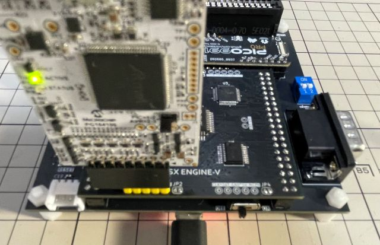
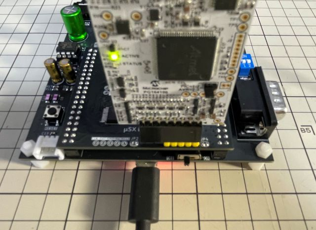

# IOEμ: μSX ENGINE-V

## 1. 概要

* μSX ENGINE-Vは、VDPを除くMSXの基本機能を統合したモジュール基板です。
* このモジュール基板上に、Zilog社のZ84C00xxFEC、4個の8-bit PIC、及び 256KBytのSRAM等を搭載しています。
* 4個の8-bit PICマイコンの協調動作により、VDPを除くMSXの各種周辺機能をエミュレーションしています。
* このμSX ENGINE-VとVDPがあればMSX互換機の制作が可能です。
* 現状、MSX1に対応していますが、今後のFWアップデートでMSX2/2+にも対応する予定です。
* 入手性の良い現役の安価なPICマイコンを使用しており、その周辺回路も含めて、2026年現在でも入手可能な部品で設計しています。

## 2. 外観

以下は、ベースボード第1弾「[μSX SYSTEM Simplex](/MuSX_SYSTEM_Simplex/readme_musx_system_simplex.md)」との組合せ例です。μSX SYSTEM Simplexは、μSX ENGINE-Vの機能の一部を使用し、必要最小限の機能を実装したシンプルなMSX1互換機です。VDPにはPICO9918を採用しています。

## 3. 基本仕様

μSX ENGINE-Vは、Zilog社のZ-80 CPU「Z84C00xxFEC（xxはスピードグレード）」と、4つの8-bit PICマイコンを搭載しています。4つの8-bit PICマイコンによるリアルタイムエミュレーションにより、以下の機能を実現しています。

* MAIN-ROM
* SUB-ROM ※ SLOT0を拡張します。MSX2対応時にFWアップデートで対応予定です。
* 256KByte Memory Mapper RAM
* PPI(8255)
* AY-3-8910(PSG + GPIO) ※ PSGサウンドはPIC内蔵DACより出力されます。
* Prim-SLOTSL x4 ※ 4個の基本スロットに対応します。
* CS1,CS2,CS12  ※ ROM用CS信号の出力。
* M1-1WAIT  ※ MSXの規格上、M1サイクルに1WAIT挿入する必要があります。
* VDPセレクタ ※ VDPのIOポートアドレスのデコード信号を出力可能です。
* MSXCLOCK ※ Normal mode: 3.579545MHz, Boost mode: 6MHz or 8MHz
* KeyScan ※ UART入力（シリアル入力）をMSXのKeyMatrixに変換します。
* RTC ※ MSX2/2+ブート用の機能限定版です(MSX1では使用されません)。

MAIN/SUB-ROMは、PICによるROMエミュレーションのため、バスアクセスに追加のWAITが挿入されます。このため、BIOS、BASICの動作が少し遅くなる可能性がありますが、ROMエミュレーションを使用せずに、物理ROMのMAIN-ROMをベースボード側に実装（基本スロット0）して使用することも可能です。

ROMエミュレーション以外の基本スロットへのメモリアクセスに対しては追加のWAITは挿入されないため（MSX規格のM1サイクルの1WAITは除く）、外付けMAIN-ROM、ゲームROM、RAM上で動くDOSプログラム等の場合は速度は低下しません。

MSXCLOCKは、PICから出力されます。クロック周波数は、Normal modeで3.579545MHz、Boost modeで6MHz or 8MHzです。Boost modeの使用方法は後述しますが、Z84c00xxのスピードグレードxxは、6MHzで06以上、8MHzで08以上が必要です。また、Boost modeではMSX周辺機器が正常に動作しない可能性がありますので注意ください。

※ μSX ENGINE-Vの動作テストには、Z84c0008FEC と Z84c0020FEC を使用しています。

## 4. モジュールピンアサイン

μSX ENGINE-Vモジュールのピンアサインに関しては、[回路図](schematic/MuSX_ENGINE-V.pdf)のJ1とJ2を参照下さい。各ピンの機能、仕様等は、今後公開を予定しているベースボードの回路で明示していきます。

ベースボードの回路例：[μSX SYSTEM Simplex](/MuSX_SYSTEM_Simplex/schematic/MuSX_SYSTEM_Simplex.pdf)

## 5. Key入力

UART入力（シリアル入力）をMSXのKeyMatrixに変換します。現状、PCのTeraTermとの接続を想定していますが、今後個別キーボードへの対応も行う予定です。UARTの設定は、以下の通りです。

|項目|設定値|備考
|--|--|--
|speed|9600 bps|
|data-bit|8 bit|
|parity|none|
|stop-bit|1 bit|
|フロー制御|none|

通常のキー入力(手入力)の場合、TeraTermの送信遅延は設定不要です。「0ms/文字、0ms/行」で問題ありません。**一方でプログラム等をコピーで転送する場合は、オーバーフローが発生する可能性があるため、1文字あたりのディレイを「40ms～60ms/文字」程度で調整ください。行遅延は「0ms/行」としてください。** 但し、送信遅延を設定した場合、通常のキー入力でのキーリピートのレスポンスが重くなります。プログラム転送後は送信遅延設定を「0ms/文字、0ms/行」に戻すことをおススメします。

TeraTerm VT100端末のESCシーケンスに対応しています。Windows向けキーボードでの入力を想定しており、一部のMSXキーは都合以下にアサインしています。

|Windowsキー|MSXキー|備考
|--|--|--
|home|SHIFT + HOME|画面クリア
|insert|INS|
|delete|DEL|
|back space|BS|
|end|CTRL + STOP|
|page up|SELECT|
|page down|GRAPH|
|F11|CAPS|
|F12|かな|

## 6. リセットスイッチ

μSX ENGINE-Vモジュール上にリセットスイッチはありませんが、ベースボード側に搭載できます。リセットスイッチを実装する場合は、μSX ENGINE-Vモジュール上のJP1～JP4のソルダージャンパーをショートした上で、J1のRSWnピン（Active low）にスイッチを接続してください。

**(注意) JP1～JP4のショートは、各PICマイコンのfirmwareを書き込んだ後に行って下さい。**

## 7. MAIN/SUB ROM

MAIN/SUB-ROMデータを専用ツールを使ってPICのfirmwareにマージすることで、PICによるMAIN/SUB-ROMエミュレーション機能を利用することができます（SUB ROMは今後対応予定）。

**※ MAIN/SUB-ROMデータはマージツールには同梱されていません。お手持ちのMSX本体からDUMPしてください。DUMPツールは一般公開されているもの等を利用ください。SLOT CHECKERが便利です。**

μSX ENGINE-Vは、4つの8-bit PICマイコン(回路図のリファレンス番号：U2, U3, U5, U6)を使用しますが、ROMエミュレーションを使用する場合は、U2のPIC18用firmwareにMAIN/SUB-ROMデータをマージします。

マージツール(Win用)はGUI操作で簡単に使用できます。同梱の[musx_mainrom_merge.exe](/MuSX_ENGINE-V/tools/public_release_20260816.zip)を実行（ダブルクリック）し、U2のPIC18ファームウェア(hexファイル)、MAIN-ROM(32KByteのバイナリファイル)、統合後のファイル名を指定し、「MAIN-ROMを挿入」ボタンをクリックしてください。MAIN-ROMマージ後のU2 PIC18用firmwareが生成されます。詳細は、ツールに同梱するREADMEを参照してください。

マージ後のfirmwareをU2のPIC18に書き込んでください（書き込み方法は後述）。

**※ ROMエミュレーション機能を使用しない場合（ベースボード上にSLOT0に接続する物理ROMを実装する場合）は、MAIN-ROMをマージせずに、元のfirmwareをそのままU2に書き込んでください。MAIN-ROMがマージされていないfirmwareをU2のPIC18に書き込んだ場合は、μSX ENGINE-Vの「SLOT0n」ピン（基本スロット0のスロットセレクト信号）が有効化されます。**

前述の通り、PICによるROMエミュレーションの場合は、バスアクセスに追加のWAITが挿入されますので、基板サイズ、部品コストと速度とのトレードオフです。

## 8. RTC

MSX2以降で必要となるRTC機能もブートに必要な機能に限定して実装しています（時計としては動作しません）。前述のROMエミュレーションが現時点ではSUB-ROMに対応できていませんが、物理ROMによるMAIN/SUB-ROMとVDP9938/58との組み合わせでMSX2/2+互換機を構成可能です。

※ SUB-ROMのROMエミュレーションは開発中ですが、テスト実装では動いています。

## 9. MSXCLOCK

MSXCLOCKは、U2のPIC18より出力されます。クロック周波数は、Normal modeで3.579545MHz、Boost modeで6MHz or 8MHzです。Normal/Boost modeの設定はMODEピンで変更できます。

|MODEピンのLevel|MODE|備考
|--|--|--
|High|Normal|3.579545MHz
|Low|Boost|6MHz or 8MHz ※ U2のPIC18用firmewareで選択(6MHzと8MHzは別firmware)

但し、Boost modeを利用する場合、Z84c00xxのスピードグレードxxは、6MHzで06以上、8MHzで08以上が必要です。Boost modeではMSX周辺機器が正常に動作しない可能性がありますので注意ください。μSX ENGINE-Vの動作テストには、Z84c0008FECとZ84c0020FECを使用しています。

また、MAIN/SUB-ROMをROMエミュレーションで実装する場合は、MODEピンは電源OFF、またはリセット中にのみ変更可能です（ブート時にMODEピンのレベルをラッチします）。MAIN/SUB-ROMをSLOT0の実ROMで実装する場合は、任意タイミングで切り替えできます。

※ ROMエミュレーションにおいても任意タイミングでMODE変更できるfirmwareもextrasフォルダにオマケで用意していますが、オーバーヘッドが若干増える（ROMエミュレーションの実行速度が若干落ちる）ため、あまりおススメしません。

## 10. LED

μSX ENGINE-Vモジュール上にLED(回路図のリファレンス番号：LED1)が1つ実装されていますが、このLEDはU2のPIC18が正常にブートした後に点灯します。従って、U2のPIC18にfirmwareが書き込まれていない場合は、電源オンしても点灯しません。現状、ブート確認以外の用途には使用していませんので、未実装でも構いません。

## 11. 使用例

以下、使用例です。※Xへのリンクです。

* [BASIC起動](https://x.com/kickstate7/status/2075717274753986691)
* [BASICプログラム転送](https://x.com/kickstate7/status/2083337457232490728)
* [GAMEプレイ](https://x.com/kickstate7/status/2076130453283819613)
* [GAME中のキー入力](https://x.com/kickstate7/status/2078308414539854075)
* [BOOST MODE](https://x.com/kickstate7/status/2078794689503953156)
* [MSX2起動（開発中）](https://x.com/kickstate7/status/2080880823335817374)

また、ベースボード「[μSX SYSTEM Simplex](/MuSX_SYSTEM_Simplex/readme_musx_system_simplex.md)」との組み合わせ条件にて、以下のカートリッジの起動を確認していますが、動作を保証するものではありません。

* F-1 SPIRIT
* グラディウス2
* ハイドライド3
* イー・アル・カンフー
* マッピー
* ラリーX
* IOEμ: ROM MORPH (Boost modeは6MHzまで)
* MSXπ (IDE,ロム魂)
* ESERAM air

## 12. PICマイコン用Firmwareの書き込み方法

μSX ENGINE-Vは、4つの8-bit PICマイコン(回路図のリファレンス番号：U2, U3, U5, U6)を使用しますが、それぞれにfirmwareを書き込む必要があります。

firmwareフォルダ内の**HEXファイル**は、PICマイコン用のFirmwareです。リファレンス番号と各firmwareのファイル名との対応は以下の通りです。ファイル名の[xxx]はRev番号、[n](6 or 8)はBoost mode時のクロック周波数[MHz]です。

* U2 : musx_U2_pic18_rev[xxx]_Max-[n]MHz.hex ※ MAIN-ROMマージ前のファイル名
* U3 : musx_U3_pic18_rev[xxx].hex
* U5 : musx_U5_pic16_rev[xxx].hex
* U6 : musx_U6_pic16_rev[xxx].hex

尚、前述の通り、MAIN-ROMをROMエミュレーションで利用する場合は、U2のfirmwareを書き込み前に「musx_U2_pic18_rev-xxx.hex」とMAIN-ROMデータを、同梱のマージツール [musx_mainrom_merge.exe](/MuSX_ENGINE-V/tools/public_release_20260816.zip) を使用してマージしてください。

オンボードでのFirmware書き込み方法は以下を参考にしてください。

オンボード書き込みに必要なもの:

* [MPLAB IPE(書込みソフト)](https://www.microchip.com/en-us/tools-resources/production/mplab-integrated-programming-environment)
* [MPLAB SNAP(インサーキットデバッガ/プログラマ)](https://www.microchip.com/en-us/development-tool/pg164100)
* [スルーホール用テストワイヤ TP-200](https://akizukidenshi.com/catalog/g/g109830/)
* 5V給電用のμSX ENGINE-V用のベースボード（例：[μSX SYSTEM Simplex](/MuSX_SYSTEM_Simplex/readme_musx_system_simplex.md)）、又は5V出力の安定化電源

**μSX ENGINE-Vをベースボードに組み込んだ状態でも書き込み出来ますが、その場合、ゲームカートリッジ等は取り外してください。**

IPEソフトウェアは、マイクロチップ製マイコンの統合開発環境[MPLAB X IDE](https://www.microchip.com/en-us/tools-resources/develop/mplab-x-ide)をインストールすると一緒にインストールされます（IPEのみを選択インストール可能です）。
SNAPは、FWの書込みに使用します。SNAPの代わりに[PICkit BASIC](https://www.microchip.com/en-us/development-tool/pg164110)等も使用できます。PICkit BASICの場合、5Vの給電も可能です。

SNAPとμSX ENGINE-Vの接続にスルーホール用テストワイヤ、又は2.54mmピッチのL型のピンヘッダ（半田付け）等を使用します。テストワイヤを使用する場合は、ピン間がショートしないようにピン間を絶縁テープで保護することをお勧めします。

PICマイコンとSNAPと接続するための「2.54mmピッチで5個並んだスルーホール群」が、各PICマイコン(U2,U3,U5,U6)毎にその直近の基板上端、又は下端に計4グループあります。これらのスルーホールを使用して、書き込み対象のPICマイコンとSNAPを接続し、firmwareを書き込みます。

SNAPの1番ピン（▽マーク）を信号名「MCLR」のスルーホールに接続します。信号名は基板上のシルクを参考にして下さい。スルーホールとSNAPの各信号の並びは同じですが、基板上端のPIC18(U2,U3)用スルーホールの並びと基板下端のPIC16(U5,U6)用スルーホールの並びは逆順になっていますのでSNAP基板の表裏の向きに注意ください。

firmwareを書き込む順番は、**U2を一番最後に書き込みます（U2がブートするまでZ80のリセットは解除されないため、他の回路が誤動作することがありません）**。U3,U5,U6に関しては書き込む順番に指定はありません。

電源は、ベースボードから給電するか、又は5V出力の安定化電源をfirmwareの書き込み対象ではないスルーホール群の5VとGNDに接続して給電してください。

**(注意) U2書き込み後に、再度、U3,U5,U6にfirmwareを書き込む場合は、一旦、U2をErase(IPEを使用してErase出来ます)してから、U3,U5,U6の書き込みを行い、最後にU2の書き込みを行ってください。また、前述のリセットスイッチ用のソルダージャンパーJP4～JP4をショートしている場合、SNAPとPICマイコンのCONNECTに失敗する場合があります。その際はソルダージャンパーをOPENにして書き込みを行ってください。それでも書き込みが出来ない場合は、μSX ENGINE-Vをベース基板から外し、安定化電源を使ってμSX ENGINE-V単体で書き込みを行って下さい。**

以下は、μSX ENGINE-Vをベースボードに組み込んだ状態でのSNAPとの接続例です。

PC（IPE）、SNAP、μSX ENGINE-Vを接続後、5V電源を給電し、firmware(HEXファイル)をIPEを使って書き込みます。

IPEを起動し、以下を参考にDeviceとHEXファイルを選択下さい。DeviceはPIC18（U2,U3）が「**PIC18F57Q43**」（Family: Advanced 8-bit MCUs）、PIC16（U5,U6）が「**PIC16F13145**」（Family: Mid-Range 8-bit MCUs）です。

Deviceとfirmware(HEXファイル)を選択後、「Connect」をクリックするとIPEとターゲットのPICマイコンがリンクします。その後に「Program」をクリックするとfirmwareの書込みが行われます。「Erase」をクリックすると書き込み済みのfirmewareを消去できます。

書き込みターゲットのPICマイコンを変更する際は、必ず電源をオフしてからSNAPの接続先を変更してください。U3, U5, U6,最後にU2のfirmwareの書き込みを行って下さい。

## 13. 基板の発注方法

基板の発注方法を例示しますが、利用者の責任において実施して下さい。[IOEμの免責事項](../readme.md)を参照下さい。

基板メーカーに[JLCPCB](https://jlcpcb.com/jp)を使用される場合は、gerberフォルダ内のZIPファイル（ガーバーファイル）をそのまま[アップロード](https://cart.jlcpcb.com/jp/quote?orderType=1&stencilLayer=2&stencilWidth=100&stencilLength=100)してください。

主な基板仕様は以下の通りです。μSX ENGINE-Vの場合はカードエッジ等の特殊条件はありませんので、アップロード後の自動設定のままでもOKです。

* 寸法：ガーバーファイル（ZIPファイル）のアップロードで自動入力されます。
* 層数：**4層**
* PCB厚さ：1.6mm
* 表面仕上げ：お好みで。ENIGは品質が良いですが、費用は高くなります。
* ビア処理：レジストカバー

その他の項目はお好みで設定ください。

