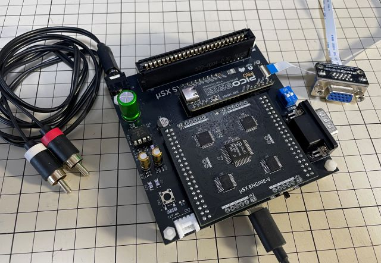
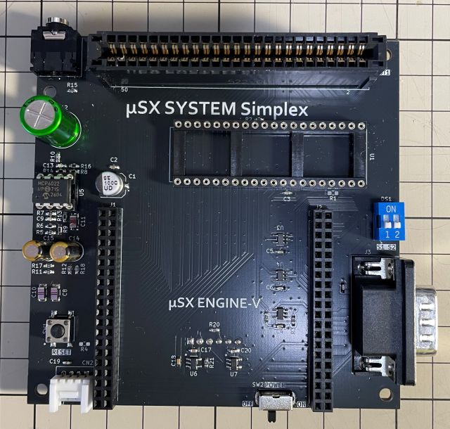
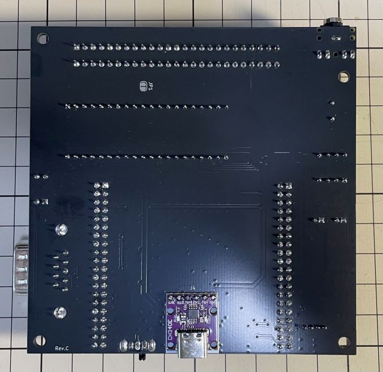
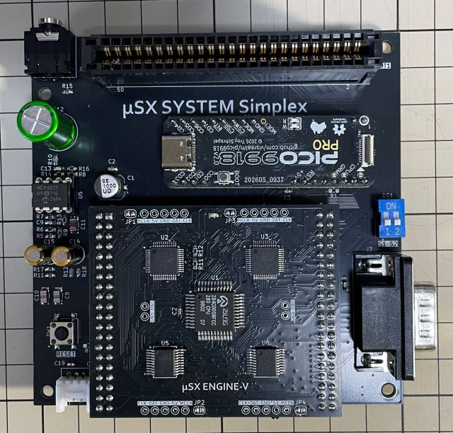

# IOEμ: μSX SYSTEM Simplex

## 1. 概要

* μSX SYSTEM Simplexは、[μSX ENGINE-V](/MuSX_ENGINE-V/readme_musx_engine-v.md)用のベースボード第1弾です。
* [μSX ENGINE-V](/MuSX_ENGINE-V/readme_musx_engine-v.md)の機能の一部を使用し、必要最小限の機能を実装したシンプルなMSX1互換機です。
* VDPには[PICO9918](https://github.com/visrealm/pico9918)を採用しており、VGA、HDMIを使用してモニタと接続できます。
* 2026年現在でも入手可能な部品で設計しています。

## 2. 外観

## 3. 基本仕様

μSX SYSTEM Simplex基板には以下の機能、部品を搭載しています。

* [μSX ENGINE-V](/MuSX_ENGINE-V/readme_musx_engine-v.md)
* [PICO9918](https://github.com/visrealm/pico9918)
* カートリッジスロット x1 ※ SLOT1のみ
* SOUND出力用アナログミキサアンプ ※ カートリッジスロットのSOUNDIN、PSG、1ビットサウンドポートをMIXします
* 音声出力用LINE-OUT ※ 3.5mm JACK
* 汎用入出力インターフェース(ATARIポート) x1 ※ PORT1のみ
* Key入力、及び5V電源給電用の[USB-シリアル変換モジュール CH340E](https://eleshop.jp/shop/g/gN9E316/)
* Groveコネクタ ※ カセットインターフェースモジュール等のオプション基板接続用。
* μSX ENGINE-Vの動作モード切替用DIPスイッチ ※ Boost mode等の切り替えスイッチ
* リセットスイッチ

**（注意） μSX SYSTEM Simplex基板は、±12V電源を搭載していませんので、±12V電源を使用するカートリッジは使用できません。**

## 4. 電源

μSX SYSTEM SimplexはUSBバスパワーで動作します。USB-シリアル変換モジュール CH340E を、μSX SYSTEM Simplexの基板裏面側J4に半田実装し、USB-シリアル変換モジュール CH340E経由で5Vを給電してください。

※ [USB-シリアル変換モジュール CH340E](https://eleshop.jp/shop/g/gN9E316/)は、共立エレショップ等で購入できます。

## 5. Key入力

USB-シリアル変換モジュール CH340E 経由のシリアル入力をMSXのKeyMatrixに変換します。PCのTeraTermとの接続を想定しています。詳細は、[μSX ENGINE-V](/MuSX_ENGINE-V/readme_musx_engine-v.md)を参照ください。

※ Key入力を使用しない場合（ゲーム等）は、USB電源アダプタ等で5Vを給電してください(PCと接続する必要はありません)。

## 6. スイッチ

### (1) 電源スイッチ

スライドスイッチ SW2は、電源スイッチです。ON/OFFは基板上のシルク表示を参考にしてください。
USBバスパワーが給電されている状態で電源スイッチをONにすると、μSXが起動します。起動後、μSX ENGINE-V上の緑色LEDが点灯します。

※ 電源スイッチをOFFにしても、USBバスパワー給電中はUSB-シリアル変換モジュール CH340E 上に搭載されている赤色LEDは消灯しませんが、μSX ENGINE-V、及びμSX SYSTEM Simplexへの給電は遮断されます（μSX ENGINE-V上の緑色LEDは消灯します）。

### (2) ディップスイッチ

ディップスイッチ DS1は、μSX ENGINE-Vの動作モード切替用スイッチです。現時点での機能割り当ては以下の通りですが、μSX ENGINE-Vのfirmwareで機能は変わります。μSX ENGINE-Vの動作モードの詳細は、[μSX ENGINE-V](/MuSX_ENGINE-V/readme_musx_engine-v.md)を参照ください。

※ μSX ENGINE-Vの標準firmwareでは電源オン直後の起動シーケンスでスイッチの状態がラッチされますので、起動完了後にスイッチを変更しても動作モードは切り替わりません。但し、パフォーマンスとのトレードオフですが、オマケ(extra)firmwareを適用することでリアルタイムに変更できるようになります。

|SW#|OFF|ON|備考
|--|--|--|--
|S1 (左)|Normal|Boost| μSX ENGINE-Vの動作モード
|S2 (右)|JIS|五十音| かなキーの配列（MSXの機能として）

### (3) リセットスイッチ

タクトスイッチ SW2は、μSXのリセットスイッチです。リセットスイッチを使用する場合は、[μSX ENGINE-V](/MuSX_ENGINE-V/readme_musx_engine-v.md)モジュール基板上のJP1～JP4のソルダージャンパーをショートしてください。これらのソルダージャンパーは初期状態ではオープンとなっており、リセットスイッチは無効となっています。

※ リセット中は、μSX ENGINE-V上の緑色LEDは消灯します。

## 7. 外部インターフェース

### (1) 電源・Key入力

基板裏面のJ4に[USB-シリアル変換モジュール CH340E ](https://eleshop.jp/shop/g/gN9E316/)を半田実装してください。前述の通り、電源給電、Key入力（シリアル入力）に使用します。

### (2) カートリッジスロット

μSX SYSTEM Simplexではスロット1のみ搭載しています。

**（注意） カートリッジの挿抜は必ず電源オフ時に行って下さい。活栓挿抜は故障の原因となります。また、μSX SYSTEM Simplex基板は、±12V電源を搭載していませんので、±12Vを使用するカートリッジは使用できません。**

### (3) 汎用入出力インターフェース(ATARIポート)

D-sub 9ピンのコネクタ J3は、汎用入出力インターフェースです。μSX SYSTEM Simplexではポート1のみ搭載していますが、MSX対応のJOYPADやマウス等を利用できます。

### (4) LINE-OUT

3.5mmステレオミニジャック J5は、SOUND出力用のLINE OUTです。ヘッドフォンやスピーカーを直接駆動できませんのでオーディオアンプに接続してください。ステレオケーブルを使用できますが、L、Rはモノラル接続です。

### (5) Groveポート

4ピンコネクタ CN2は、オプション基板との接続に使用します。Groveコネクタの互換品です。データレコーダー（カセット）インターフェース等の独自のオプション基板を用意する予定です。

### (6) モニタ出力

モニタとの接続は、PICO9918付属のVGAアダプタ、又はHDMIアダプタを使用してください。これらのアダプタはPICO9918とFFCケーブルで接続します。詳細は[PICO9918](https://github.com/visrealm/pico9918)の仕様を参照してください。

## 8. 使用例

以下、使用例です。※ Xへのリンクです。

* [BASICプログラム転送](https://x.com/kickstate7/status/2083337457232490728)
* [GAMEプレイ](https://x.com/kickstate7/status/2076130453283819613)
* [GAME中のキー入力](https://x.com/kickstate7/status/2078308414539854075)
* [BOOST MODE](https://x.com/kickstate7/status/2078794689503953156)
* [SIZE感](https://x.com/kickstate7/status/2078411212296192333)

また、以下のカートリッジの起動確認していますが、動作を保証するものではありません。

* F-1 SPIRIT
* グラディウス2
* ハイドライド3
* イー・アル・カンフー
* マッピー
* ラリーX
* IOEμ: ROM MORPH (Boost modeは6MHzまで)
* MSXπ (IDE,ロム魂)
* ESERAMair

**※ μSX SYSTEM Simplex基板は±12V電源は実装していませんので、±12V電源を使用するカートリッジは使用できません。**

## 9. 基板の発注方法

基板の発注方法を例示しますが、利用者の責任において実施して下さい。[IOEμの免責事項](../readme.md)を参照下さい。

基板メーカーに[JLCPCB](https://jlcpcb.com/jp)を使用される場合は、gerberフォルダ内のZIPファイル（ガーバーファイル）をそのまま[アップロード](https://cart.jlcpcb.com/jp/quote?orderType=1&stencilLayer=2&stencilWidth=100&stencilLength=100)してください。

主な基板仕様は以下の通りです。μSX SYSTEM Simplexの場合はカードエッジ等の特殊条件はありませんので、アップロード後の自動設定のままでもOKです。

* 寸法：ガーバーファイル（ZIPファイル）のアップロードで自動入力されます。
* 層数：2層
* PCB厚さ：1.6mm
* 表面仕上げ：お好みで。ENIGは品質が良いですが、費用は高くなります。
* ビア処理：レジストカバー

その他の項目はお好みで設定ください。

