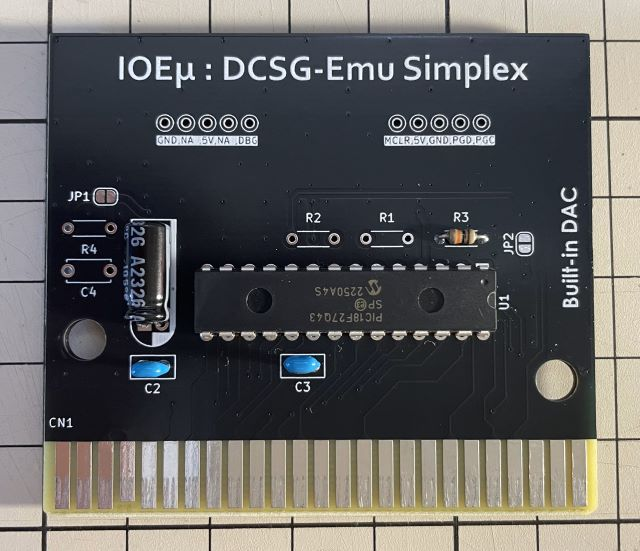
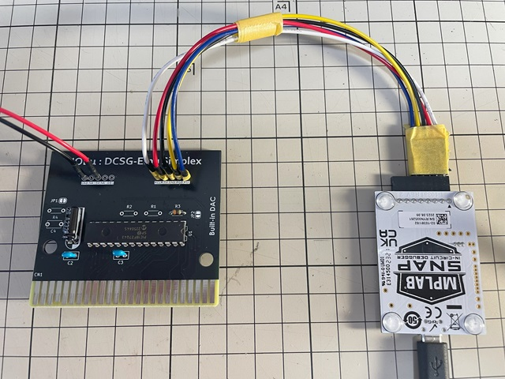
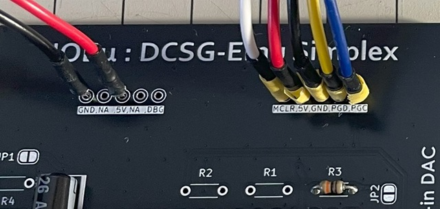
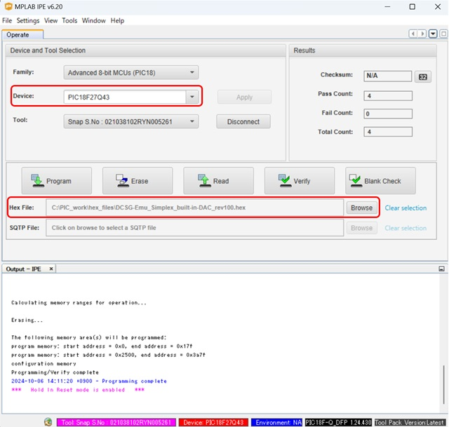

# IOEμ: PSG-Emu Simplex

## 1. 概要

* PSG-Emu Simplex(以降、PSG-Emu)は、[DCSG-Emu Simplex](/DCSG-Emu_Simplex/readme_dcsg-emu.md)の派生モデルです。
* Schematic、GerberデータはDCSG-Emu Simplexと共通です。
* PSG-Emu Simplexでは、矩形波音源をPSGに変更しました。
* PSG-Emu Simplexは、8-bit PICマイコンによるAY-3-8910音源のエミュレーターです。
* MSX実機上でAY-3-8910互換音源として使用できます。
* PICのファームウェアは、1st-PSG版、2nd-PSG版の2種類を用意しています。
* 1st-PSGは、MSX本体内蔵のPSGと同一のIOポートアドレスにアサインされます。
* このため、本体内蔵のPSGとのIOバスの衝突を避けるため、レジスタは書き込み専用です。
* 1st-PSGは、サウンド出力機能を搭載するIOEμ:SlotExpander MIX+（準備中）と一緒に使用をすることを想定しています。
* 一方、2nd-PSGのIOポートアドレスはユーザー領域の0x10-0x12にアサインされます。
* このIOポートアドレスはDouble PSGと同一のため、Double PSG対応ソフトでPSG-Emuを使用できます。
* 2nd-PSGのレジスタはRead/Write可能です。
* サウンド波形の出力には、PICマイコン内蔵DACを使用しています。
* トーンの生成にはPICマイコン搭載機能を活用し、4ch(Tone x3 + Noise x1)独立制御を実現しています。
* このため、PICの8-bit CPUの負荷に影響を受けず、安定したトーンの再生が可能です。
* ハードウェアエンベロープの制御は専用タイマーを用いてエミュレーションしています。
* PICの8-bit CPUは、MSXバスのエミュレーション、波形合成（MIX）、及びエンベロープの制御に使用しています。
* アドレスデコード回路を必要とせず、DACもPIC内蔵のものを使用しているため、回路は1 chip構成です。
* 加えて、PICマイコンに小型で入手性の良いDIPチップ品を採用しており、安価で組み立ても容易です。(秋月さんで部品は揃います)

## 2. 外観

※ PSG-Emu Simplexの基板は、DCSG-Emu Simplex基板と共通です（添付のGerberデータはシルク表示のみPSG-Emu Simplexに変更してます）。

## 3. 使用方法

MSX本体の電源をオフしてから、空きスロットにPSG-Emuのファームウェアを書き込んだ**DCSG-Emu Simplex基板**（以下、PSG-Emu）を挿入して下さい。

1st-PSG版はMSX本体のPSGと同じIOポートアドレスを使用しているため、通常単体での利用は想定していません。SlotExpander MIX+（準備中）と一緒に使用することを想定しています。このSlotExpanderのミキサ回路によりSCC、FM音源カートリッジ等のサウンド出力とPSG-Emuの出力をMIXして、SlotExpanderのLINE-OUTから出力することが出来ます。

2nd-PSG版はDouble PSGと同じポートアドレスにアサインしていますので、Double PSG対応ソフト（VGM Playerや一部のゲームソフト等）で使用できます。

以下、それぞれのIOポートアドレスです。
PSGレジスタの仕様はMSXテクニカルハンドブックやAY-3-8910のデータシート等を参照してください。

### 1st-PSG版：
|IO-port address|R/W|機能
|--|--|--
|0xA0|W|レジスタアドレスラッチ
|0xA1|W|レジスタ書き込み
|0xA2|-|未使用

### 2nd-PSG版：
|IO-port address|R/W|機能
|--|--|--
|0x10|W|レジスタアドレスラッチ
|0x11|W|レジスタ書き込み
|0x12|R|レジスタ読み出し

## 4. 使用上の注意

### (1) ファームウェアの種類

PSG-Emuのファームウェアには、前述の通り、1st-PSG版と2nd-PSG版があります。
これらに加えて、今後、PWM版をリリースする予定です。

標準ファームウェアはPIC内蔵DACを使用していますが、DCSG/PSG-Emu Simplex基板では、このDACの高インピーダンスの出力を直接サウンド出力に使用するため、SOUND入力の入力インピーダンスが比較的低いMSX本体の場合は音が歪む可能性があります（OneChipBook、CX5Fでは歪むことを確認しています）。DAC版で音が歪むなどの音質異常が発生する場合は、PWM版（準備中）のファームウェアをお試しください。

※ IOEμ: SlotExpander MIX+と一緒に使用する場合は、標準のDAC版ファームウェアを使用してください。

### (2) MSX本体のリセット

PSG-Emuは、MSX本体のリセット信号を使用していません。
そのため、PSG-Emuが発音中にリセットすると、その時点で発声していた音が鳴り続けます。
この場合、電源をオフするか、再度、PSG-Emuの各制御レジスタを初期化して下さい。

### (3) 動作確認済みの機種

現時点で以下の機種はDAC版のファームウェアで動作することを確認しています。

* FS-A1GT (turboR)
* HB-F1XDJ (MSX2+)
* IOEμ:SlotExpander MIX+（高Z入力のMIX回路付き拡張スロット） ※リリース準備中です。

以下の機種はSOUND入力の入力インピーダンスの問題でDAC版ファームウェアでは歪が発生します。IOEμ:SlotExpander MIX+（準備中）と併用頂くか、今後リリース予定のPWM版ファームウェアを使用ください。

* CX5F (MSX)
* OneChipBook (MSX2+互換機)

## 5. PICマイコン用Firmwareの書き込み方法

firmwareフォルダ内の**HEXファイル**は、PICマイコン用のFirmwareです。Firmwareをオンボードで書き込むことも可能です。

**但し、Firmwareをオンボードで書き込む場合、必ず、MSX本体からPSG-Emuを取り外した状態で行ってください。MSX本体に挿入した状態ではFirmwareの書き込みは出来ません。MSX本体の故障の原因にもなります。**

オンボード書き込みに必要なもの:

* [MPLAB IPE(書込みソフト)](https://www.microchip.com/en-us/tools-resources/production/mplab-integrated-programming-environment)

* [MPLAB SNAP(インサーキットデバッガ/プログラマ)](https://www.microchip.com/en-us/development-tool/pg164100)

* [スルーホール用テストワイヤ TP-200](https://akizukidenshi.com/catalog/g/g109830/)

* 5V出力の安定化電源

IPEソフトウェアは、マイクロチップ製マイコンの統合開発環境[MPLAB X IDE](https://www.microchip.com/en-us/tools-resources/develop/mplab-x-ide)をインストールすると一緒にインストールされます。
SNAPは、FWの書込みに使用します。
SNAPの代わりに[PICkit BASIC](https://www.microchip.com/en-us/development-tool/pg164110)等も使用できます。

SNAPとPSG-Emuの接続にスルーホール用テストワイヤを使用します。
**テストワイヤ間がショートしないようにピン間を絶縁テープで保護することをお勧めします。**
テストワイヤ TP-200の代わりに2.54mmピッチのL型のピンヘッダ（半田付け）も使用できます。

* SNAPは、以下写真のように基板右側の5個並んだスルーホール群とテストワイヤを使って接続します。
* 信号名は基板上のシルクを参考にして下さい。スルーホールとSNAPの各信号の並びは同じですが、逆順に接続しないように注意ください。
* 安定化電源は、基板左側のスルーホール群の中の5VとGNDのスルーホールをテストワイヤを使って接続し、5Vを給電してください。

**※ Fireware書込み時は絶対にPSG-EmuをMSX本体に接続しないで下さい。故障の原因になります。また、カードエッジ部を絶縁することをお勧めします（写真の例では絶縁はしていません）。**

PC（IPE）、SNAP、PSG-Emuを各ケーブルで接続後、firmwareフォルダ内のHEXファイルをIPEを使って書き込みます。
PSG-Emu Simplex用のHEXファイルを使用してください。

以下を参考に、DeviceとHEXファイルを選択下さい。Deviceは「**PIC18F27Q43**」です。Familyは「Advanced 8-bit MCUs(PIC18)」です。

DeviceとHEXファイルを選択後、「Connect」をクリックするとIPEとPSG-Emu(PIC18マイコン)がリンクします。その後に「Program」をクリックするとFWの書込みが行われます。

## 6. 基板の発注方法

基板の発注方法を例示しますが、利用者の責任において実施して下さい。[IOEμの免責事項](../readme.md)を参照下さい。

基板メーカーに[JLCPCB](https://jlcpcb.com/jp)を使用される場合は、gerberフォルダ内のZIPファイル（ガーバーファイル）をそのまま[アップロード](https://cart.jlcpcb.com/jp/quote?orderType=1&stencilLayer=2&stencilWidth=100&stencilLength=100)してください。

主な基板仕様は以下の通りです。

* 寸法：ガーバーファイル（ZIPファイル）のアップロードで自動入力されます。
* 層数：2層
* PCB厚さ：1.6mm
* 表面仕上げ：お好みで。ENIGは品質が良いですが、費用は高くなります。
* ビア処理：レジストカバー
* カードエッジコネクタ：YES (表面仕上げでENIGを使用しない場合もYESとしてください)
* 30°端子取り：YES
* 端面スルーホール：No
* エッジメッキ：No

その他の項目はお好みで設定ください。
