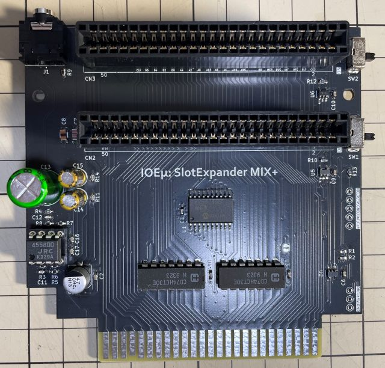
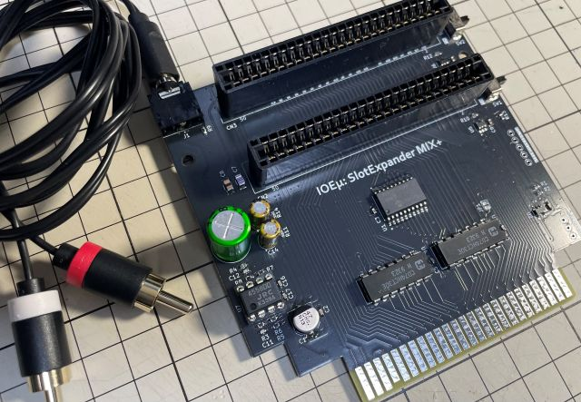
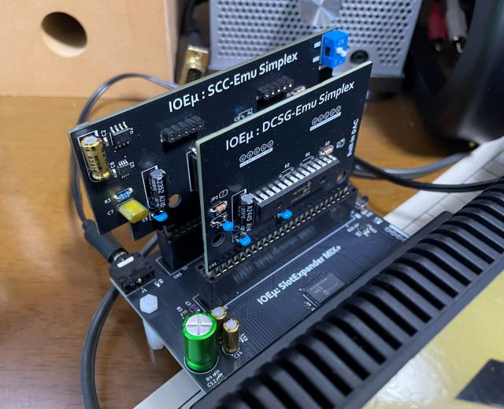
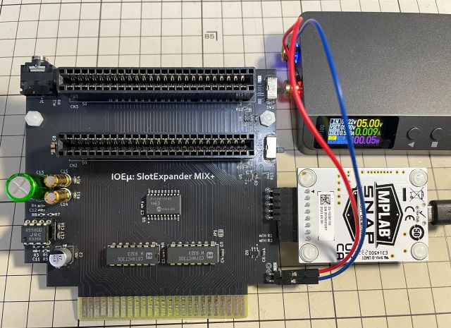
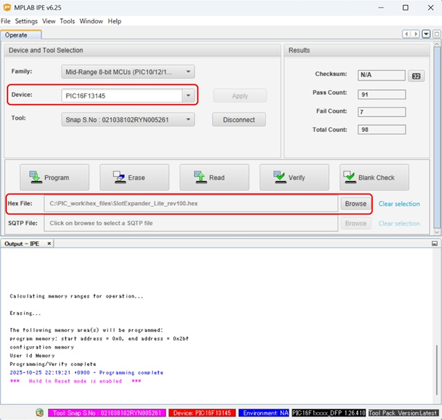

# IOEμ: SlotExpander MIX+

## 1. 概要

* IOEμ: SlotExpander MIX+(以降、MIX+)は、8-bit PICマイコン(PIC16F13145)で制御するMSX用の拡張スロットです。
* 拡張スロットとしての仕様は、[IOEμ: SlotExpander Lite](/SlotExpander_Lite/readme_slotexpander_lite.md)と同じです。
* MIX+では、Lite版の機能にLINE-OUTを備えたMixer-Amp回路を追加しました。
* MIX+のミキサ回路でミキシングされた各スロットのSOUND信号はMSX本体のアンプを経由せずにLINE-OUTより出力できます。
* このため経年劣化等によりMSX本体経由の音声出力ではノイズが重畳する場合でも、ノイズを軽減出来ます。
* 例えば、「[PSG-Emu Simplex](/PSG-Emu_Simplex/readme_psg-emu.md)の1st-PSG」と「SCC対応ゲームカットリッジ」をセットでMIX+のスロットに接続すれば、SCCとPSGのサウンドをMIXしてLINE-OUTから出力できます。低ノイズのサウンドでゲームが楽しめるかも...
* LINE-OUT（3.5mm JACK）にプラグを接続すると音声出力はLINE-OUTとなり、プラグ未接続の場合はMSX本体アンプ出力になります。
* MIX+は、MSX本体背面スロットに接続して使用することを想定しています。
* MSX接続時の奥行を短くすることを優先し、スロット数は 2slotsとしています。
* 各スロットはイネーブルスイッチを搭載しており、MSX本体起動時にカートリッジを無効化することが出来ます。
* 入手性の良い現役の安価なPICマイコンを使用しており、その周辺回路も含めて、2025年現在でも入手可能な部品で設計しています。

使用例は[こちら](https://x.com/kickstate7/status/2055413018775920748)。※Ｘへのリンクです。

## 2. 外観

## 3. 使用方法

基本的な使い方は一般的なMSX用の拡張スロットと同じです。MSX本体の電源をオフにしてからスロットにカートリッジを挿入し、電源をオンしてください。

### スロットイネーブルスイッチ：

各スロットにはイネーブルスイッチが付いています。Slot0用がSW1、Slot1用がSW2です。一時的にゲームROM等のカートリッジを起動したくない場合にスイッチをオフすると、そのカートリッジからのブートを無効にできます。但し、IOポート系は無効にできません。

### SOUND Mixer-Amp & LINE-OUT：

前述の通り、LINE-OUTを備えたMixer-Amp回路を搭載しています。Mixer回路の入力は高入力インピーダンス設計のため、PSG-Emu Simplex、DCSG-Emu SimplexのようにPIC内蔵DACの出力を直接出力する基板も使用できます。

LINE-OUTは3.5mmジャックのため、RCA-3.5mmプラグ変換ケーブル等を用いてオーディオアンプと接続してください。ヘッドホンには未対応です（ヘッドホンのような低インピーダンスの負荷をLINE-OUTでは直接駆動することは出来ません）。LINE-OUTにプラグを接続しない場合は、Mixer-Amp回路の出力先はMSX本体のアンプ（スロットのSOUND信号）に切り替わります。

例えば、「PSG-Emu Simplexの1st-PSG」と「SCC搭載ゲームカートリッジ」の両方を2スロットのMIX+にセットすることで、PSGとSCCサウンドをミキシングし、LINE-OUTより出力することが出来ます。PSG+SCCの低ノイズサウンドを楽しめるかもしれません（環境に依存します）。

## 4. 使用上の注意

### (1) LINE-OUT出力の電源ON時のPOP音

LINE-OUTに接続するAUDIO用アンプ等のボリュームは、MSX本体の電源をオンにする際は、最小にして下さい。電源オン時にPOP音が発生します。

### (2) 動作確認済みのMSX本体、及びカートリッジ

拡張スロット部の仕様はSlotExpander Liteと同じですので、[Lite版のReadme](/SlotExpander_Lite/readme_slotexpander_lite.md)を参照下さい。

### (3) MSX本体のリセット

MIX+は、MSX本体のリセット信号を使用していません。リセットの代わりにMSX本体の電源をオフしてください。

## 5. PICマイコン用Firmwareの書き込み方法

firmwareフォルダ内の**HEXファイル**は、PICマイコン用のFirmwareです。
オンボードでのFirmware書き込み方法は以下を参考にしてください。

**Firmwareをオンボードで書き込む場合、必ず、MSX本体からMIX+を取り外し、MIX+のスロットにも何も挿さない状態で行ってください。MSX本体に挿入した状態ではFirmwareの書き込みは出来ません。MSX本体の故障の原因にもなります。**

オンボード書き込みに必要なもの:

* [MPLAB IPE(書込みソフト)](https://www.microchip.com/en-us/tools-resources/production/mplab-integrated-programming-environment)

* [MPLAB SNAP(インサーキットデバッガ/プログラマ)](https://www.microchip.com/en-us/development-tool/pg164100)

* [スルーホール用テストワイヤ TP-200](https://akizukidenshi.com/catalog/g/g109830/)

* 5V出力の安定化電源

IPEソフトウェアは、マイクロチップ製マイコンの統合開発環境[MPLAB X IDE](https://www.microchip.com/en-us/tools-resources/develop/mplab-x-ide)をインストールすると一緒にインストールされます（IPEのみを選択インストール可能です）。
SNAPは、FWの書込みに使用します。
SNAPの代わりに[PICkit BASIC](https://www.microchip.com/en-us/development-tool/pg164110)等も使用できます。

SNAPとMIX+の接続にスルーホール用テストワイヤ、又は2.54mmピッチのL型のピンヘッダ（半田付け）を使用します。
**テストワイヤを使用する場合は、ピン間がショートしないようにピン間を絶縁テープで保護することをお勧めします。**

基板にはSNAPと接続するための「2.54mmピッチで5個並んだスルーホール群」がSW1の下（カードエッジ部を下とした場合）にあります。電源は、SNAP接続用のスルーホール群のさらに下にある3個並んだスルーホール群の中の5VとGNDのスルーホールを使用して5Vを給電してください。以下の写真を参考にして下さい。写真の例ではL形のピンヘッダを使用しています。

* 信号名は基板上のシルクを参考にして下さい。スルーホールとSNAPの各信号の並びは同じですが、逆順に接続しないように注意ください。

**※ Fireware書込み時は絶対にMIX+をMSX本体に接続しないで下さい。故障の原因になります。また、カードエッジ部を絶縁することをお勧めします（写真の例では絶縁はしていません）。**

PC（IPE）、SNAP、SlotExpander_Liteを各ケーブルで接続後、firmwareフォルダ内のHEXファイルをIPEを使って書き込みます。

以下を参考に、DeviceとHEXファイルを選択下さい。Deviceは「**PIC16F13145**」（Family: Mid-Range 8-bit MCUs）です。

DeviceとHEXファイルを選択後、「Connect」をクリックするとIPEとSlotExpander_LiteのPICマイコンがリンクします。その後に「Program」をクリックするとFWの書込みが行われます。

## 6. 基板の発注方法

基板の発注方法を例示しますが、利用者の責任において実施して下さい。[IOEμの免責事項](../readme.md)を参照下さい。

基板メーカーに[JLCPCB](https://jlcpcb.com/jp)を使用される場合は、gerberフォルダ内のZIPファイル（ガーバーファイル）をそのまま[アップロード](https://cart.jlcpcb.com/jp/quote?orderType=1&stencilLayer=2&stencilWidth=100&stencilLength=100)してください。

主な基板仕様は以下の通りです。

* 寸法：ガーバーファイル（ZIPファイル）のアップロードで自動入力されます。
* 層数：2層
* PCB厚さ：1.6mm
* 表面仕上げ：お好みで。ENIGは品質が良いですが、費用は高くなります。
* ビア処理：レジストカバー
* カードエッジコネクタ：YES (表面仕上げでENIGを使用しない場合もYESとしてください)
* 面取り：30°
* 端面スルーホール：No
* エッジメッキ：No

その他の項目はお好みで設定ください。

